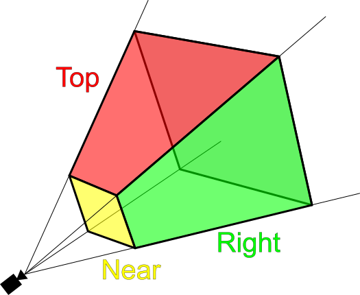

# Computer Graphics - Terminology

* [Vertex](#vertex)
* [Mesh](#mesh)
* [UV Mapping](#uv-mapping)
* [UV Coordinates](#uv-coordinates)
* [Orthographic projection](#orthographic-projection)
* [Perspective projection](#perspective-projection)
* [Viewing Frustum](#viewing-frustum)
* [Alpha Test](#alpha-test)
* [Gamma Correction](#gamma-correction)
* [World Space](#world-space)
* [Camera Space](#camera-space)
* [Clip Space](#clip-space)
* [Normalized Device Coordinates](#normalized-device-coordinates)
* [Screen Space](#screen-space)
* [Perspective Division](#perspective-division)
* [SDF](#sdf)
* [View Frustum](#view-frustum)
* [Texel](#texel)
* [Projected Texture](#projected-texture)

## Vertex

- A point in 3D space
- Represents a specific point on a polygon or a [mesh](#mesh)
- Vertex typically has properties such as **position**, **color**, **texture**

> vertices is plural of vertex

## Mesh

- mesh is a collectoin of [vertices](#vertex), edges and faces

## UV Mapping

- A process of projecting 2D image onto a 3D model's surface
- U, V denote X, Y
- Helps to apply textures to 3D models

## UV Coordinates

## Orthographic projection

- all object shown at the **same scale**, **regardless of distance**
- can **accurately** represent object's **size** and **shape**
- suitable for **2D** game art, and **architectural** and **drawing** design

## Perspective projection

- mimic the way the **human eye** sees
- suitable for **realistic** and **natural-looking** rendering

## Viewing Frustum

## Alpha Test

- a technique to **reduce** the number of **pixels** that need to be **rendered**
- use pixels alpha value to determine whether to render it or not
- which can avoiding the performance overhead, for example
  - leaves on a tree
  - window on a building

## Gamma Correction

- is the process of **adjusting the brightness of images or videos**
- to compensate for the human eye's **non-linear** perception of color and light
- without gamma correction, images or videos appear **too dark** or **too bright** on different devices

## World Space

## Camera Space

> Also known as **View Space**

Features

- Effected by camera's **position** and **orientation**

## Clip Space

Calculated by the [MVP(Mode-View-Projection)](computer-graphics-matrices.md) matrix

- $ClipSpacePos = ProjectionMatrix * ViewMatrix * ModelMatrix * VertexPosition;$

Features

- Unlimit coordinates range
- Any part outside [view frustum](#view-frustum) will be clipped

The process before clip space to [normalized device coordinates](#normalized-device-coordinates) 

- Called [perspective division](#perspective-division) 

## Normalized Device Coordinates

- After the [perspective division](#perspective-division), the coordinates are normalized to the range of $[-1, 1]$
- A [vec3]() vector

## Screen Space

> I would like to think of it as a clipped, perspective-divided, and normalized clip space

Range

- Ralated to the screen resolution
- From $[0, 0]$ to $[width, height]$

## Perspective Division

What It Is

- A process of converting **clip space** coordinates to [normalized device coordinates](#normalized-device-coordinates)

What it does

- Dividing the **x**, **y**, and **z** by the **w** component

## SDF

- Signed Distance Field

## View Frustum

what's this

Breakdown 

- ...

## Texel

- Means tex-el, texture element
- Smallest unit of texture, like [pixel](#pixel) is the smallest unit of an image

Relationship between between texel and pixel

1. Minification: large texture is applied to a small area

- In this case, multiple texels to one pixel

2. Magnification: small texture is applied to a large area

- In this case, one texel to multiple pixels

## Projected Texture

- A texture is mapped onto a surface using [projection method]()
- Distingush from mapping a texture on a surface based on [uv](#uv-mapping), projected texture is based on camera's and light's
- Like how a projector projects an image onto a screen

## Depth Buffer

