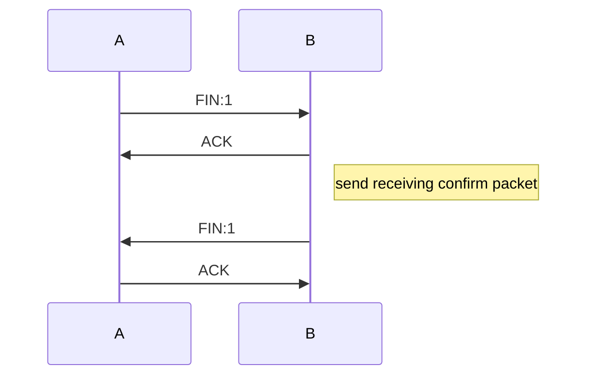
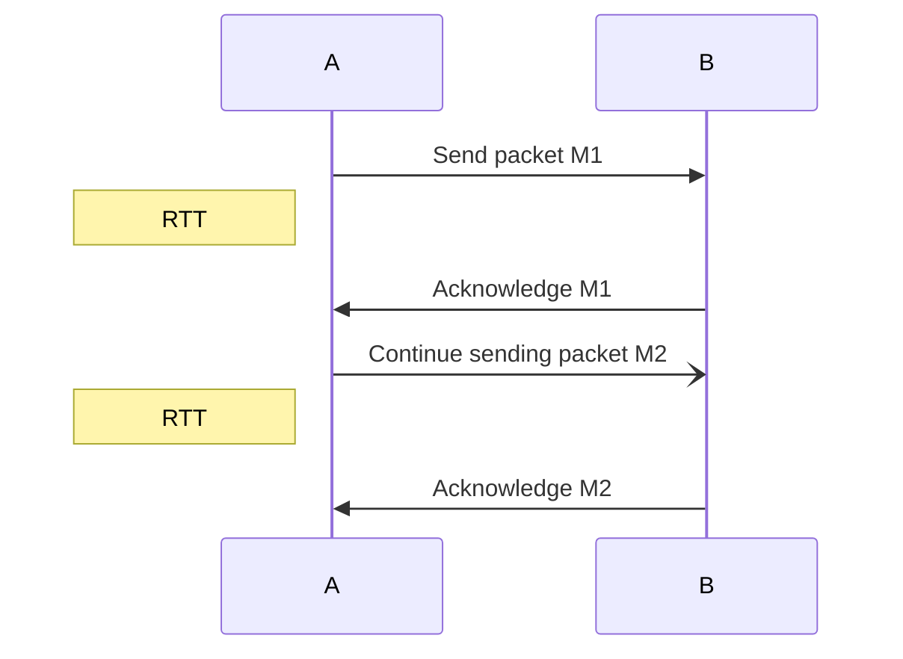
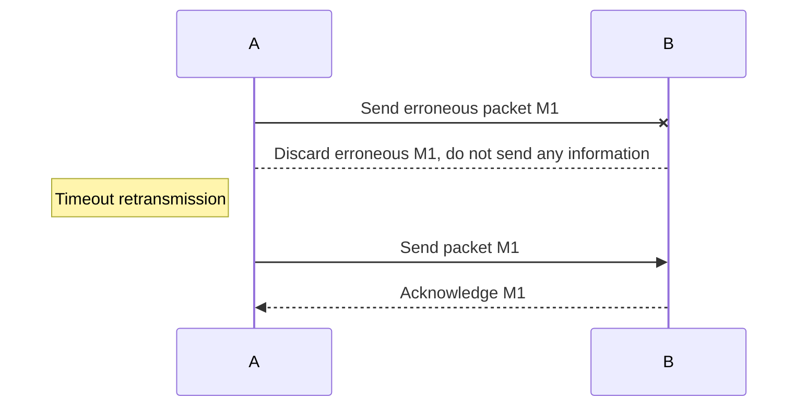
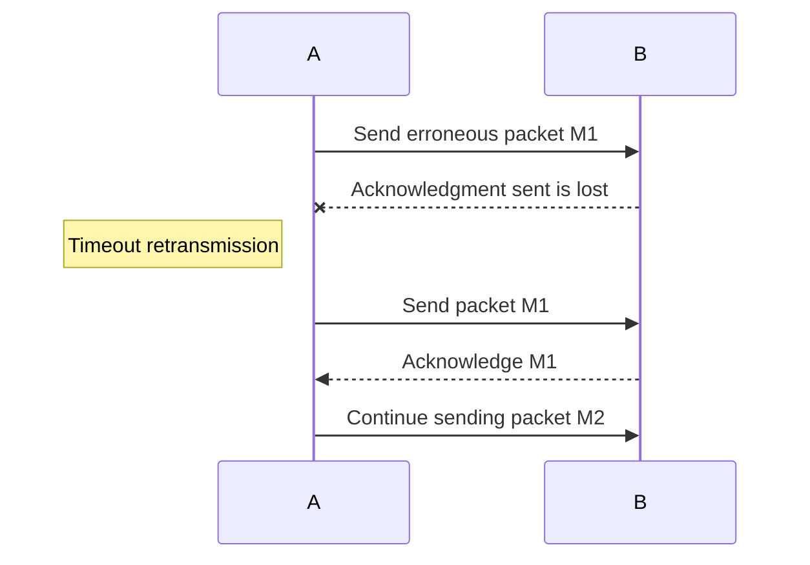

# Computer Network - Reliable Transmission

## Three-way Handshake

- `TCP SYN` from Client to Server
- `TCP SYN/ACK` From Server to Client
- `TCP ACK` from server to Server

## Four-way Handshake

Start With A send disconnect request

## Normal Case

- After sending each [network-group](network-group.md), stop sending and wait for acknowledgment from the other party. Only after receiving the acknowledgment, send the next one.
  - After A sends a packet, it temporarily keeps a copy of the sent packet.
  - Both packets and acknowledgment packets must be numbered.
  - The retransmission time set by the timeout timer should be longer than the average round-trip time of data transmission in the packet.

## Abnormal Cases

### 1. No response

### 2. Acknowledgment from B is lost

1. A retransmits.
2. B discards the duplicate M1.
3. Sends acknowledgment to A.

### 3. Acknowledgment from B is delayed

1. A retransmits.
2. B discards the duplicate M1.

## Go-Back-N ARQ Protocol (Continuous ARQ Protocol)

- The sender maintains a sending window, and all packets in the window can be sent continuously without waiting for acknowledgment from the other party, improving [channel utilization](信道利用率.md).
- Each time the sender receives an acknowledgment, it slides the sending window forward by one packet position.
- The receiver does not need to send acknowledgments one by one; it only sends an acknowledgment for the last received packet, indicating that the current packet and all preceding packets have been correctly received.

[Timeout Retransmission](超时重传.md)
