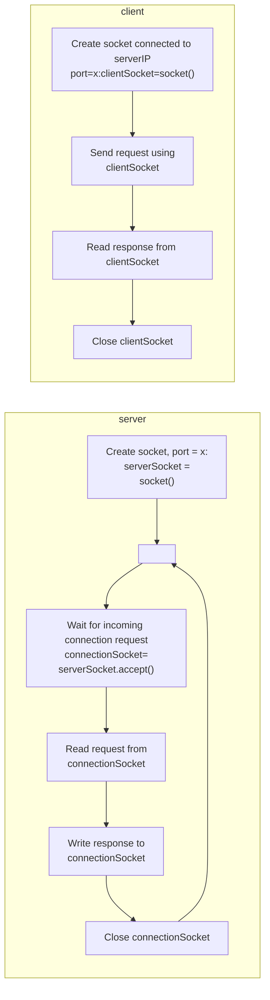

# Computer Network - TCP Socket Programming



TCPClient.py

```python
from socket import *

serverName = 'servername'  
serverPort = 12000

clientSocket = socket(AF_INET, SOCK_STREAM)  

# Create Socket

clientSocket.connect((serverName, serverPort))  

# Server name, server port

sentence = input('Input lowercase sentence:')  

# Get input from user, put into variable sentence

clientSocket.send(sentence.encode())  

# Send socket to Server

modifiedSentence = clientSocket.recv(1024)  

# Receive socket, 1024 is buffer length

print('From Server: ', modifiedSentence.decode())  
clientSocket.close()
```

TCPServer.py

```python
from socket import *  
  
serverPort = 12000  
serverSocket = socket(AF_INET, SOCK_STREAM)  

# Create Socket

serverSocket.bind(('', serverPort))  

# Associate serverPort with the socket

serverSocket.listen(1)  

# Make the server listen for TCP connection requests from clients

print('The server is ready to receive')  

while True:  
    connectionSocket, addr = serverSocket.accept()  
    
    # Create a dedicated socket connectionSocket for the client
    
    sentence = connectionSocket.recv(1024).decode()  
    
    # Receive bytes sent by the user
    
    capitalizedSentence = sentence.upper()  
    connectionSocket.send(capitalizedSentence.encode())  
    connectionSocket.close()
```
