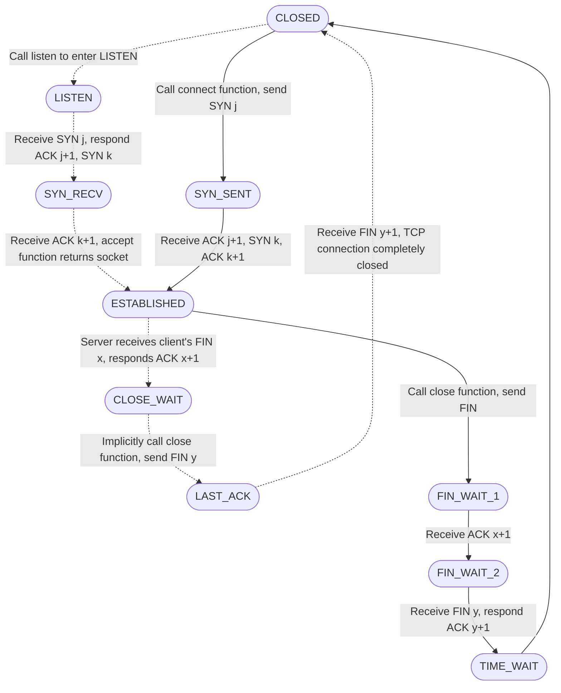
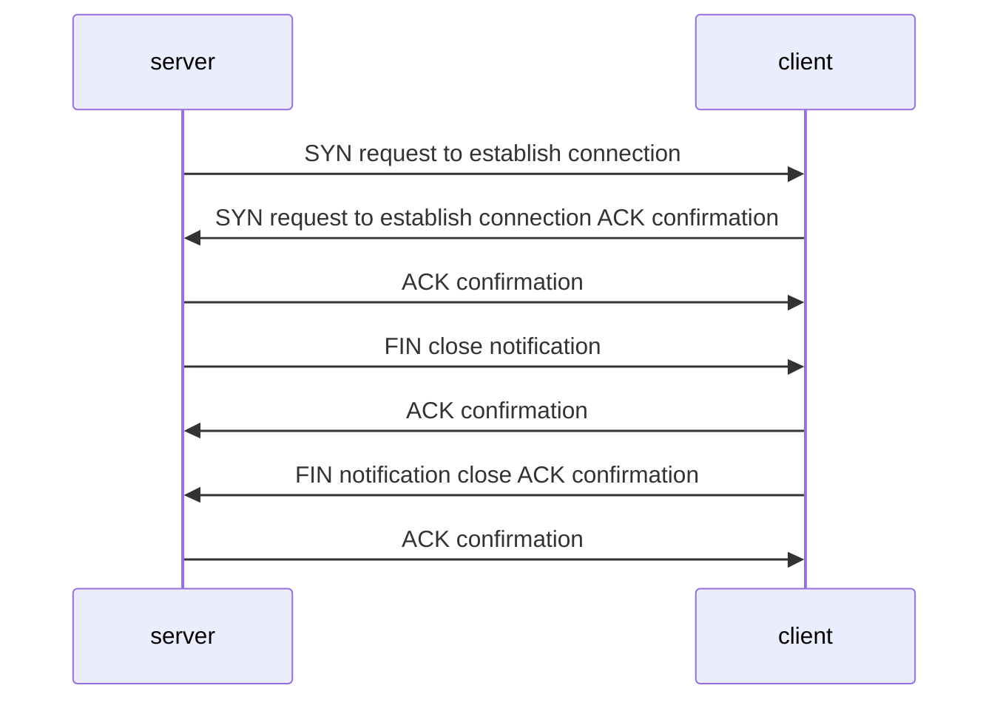
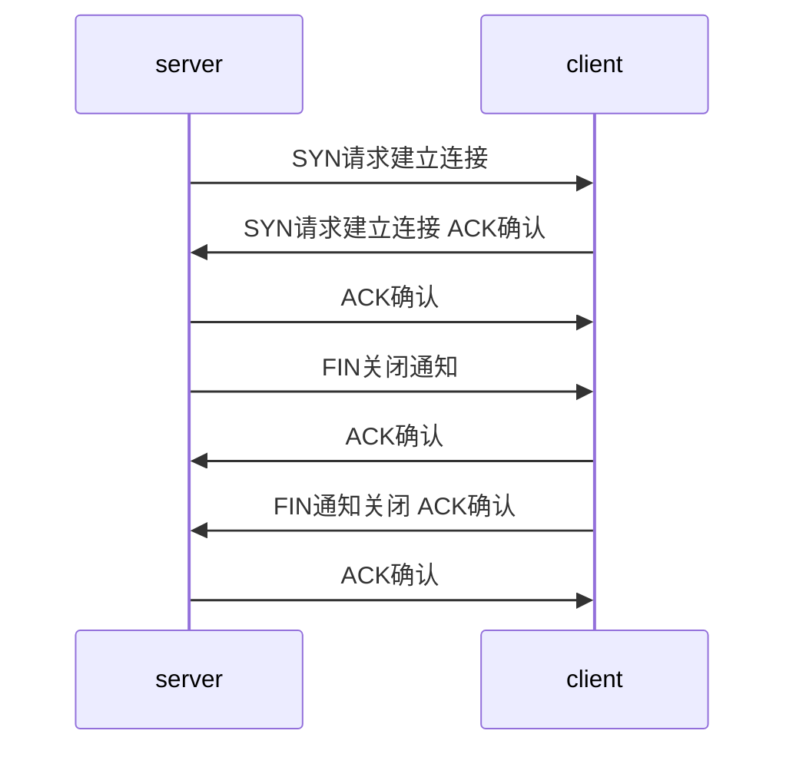

# TCP Status

## Description

- TCP will always be in one of these statuses at any time.

## TCP Status

- LISTEN: Server is waiting for a connection.
  - Client is in `SYN_RCVD` status and receives [RST](tcp-message-header-sturture.md) message.
  - Server calls [listen()](linux-socket-api-listen().md).
- CLOSED:
  - Server receives ACK message in LAST_ACK.
- SYN_RCVD:
  - Client receives SYN or sends SYN, ACK in SYN_SENT status.
  - Server receives RST or sends SYN, ACK in LISTEN status.
- SYN_SENT:
  - Client calls [connect()](linux-socket-api-connect()函数.md) in CLOSED status, sends [SYN](tcp-message-header-sturture.md) message.
- ESTABLISHED: Both sides of the connection can perform bidirectional data transfer.
  - Server receives [ACK](tcp-message-header-sturture.md) message in SYN_RCVD status.
  - Client receives SYN,ACK or sends ACK in SYN_SENT status.
- CLOSE_WAIT: Client actively closes the connection.
  - Server sends [ACK](tcp-message-header-sturture.md) or receives FIN message in ESTABLISHED status, then enters CLOSE_WAIT.
- LAST_ACK: Waits for the client's final acknowledgment of the termination segment. Once the acknowledgment is complete, the connection is completely closed.
  - Server sends [FIN](tcp-message-header-sturture.md) message in CLOSE_WAIT status.

> In Linux, you can view the current status using the [netstat](netstat.md) command.

## Normal Process

> Solid lines represent the server, dashed lines represent the client.

## Three Handshakes and Four Waves

- After the server receives a disconnect (FIN) message, the server may not immediately close the socket, so it first replies with an acknowledgment (ACK) message.
- When the server receives the `FIN` message,
- it may not close the socket immediately.
- So it will send the `ACK` message first.

## three handshakes and four waves

- 服务端接收到请求断开(FIN)报文后, 服务端不一定立即关闭socket，所以先回复收到确认(ACK)报文
- when server receive the `FIN` message, 
- it may not close the socket immediately
- so it will send the `ACK` message first

