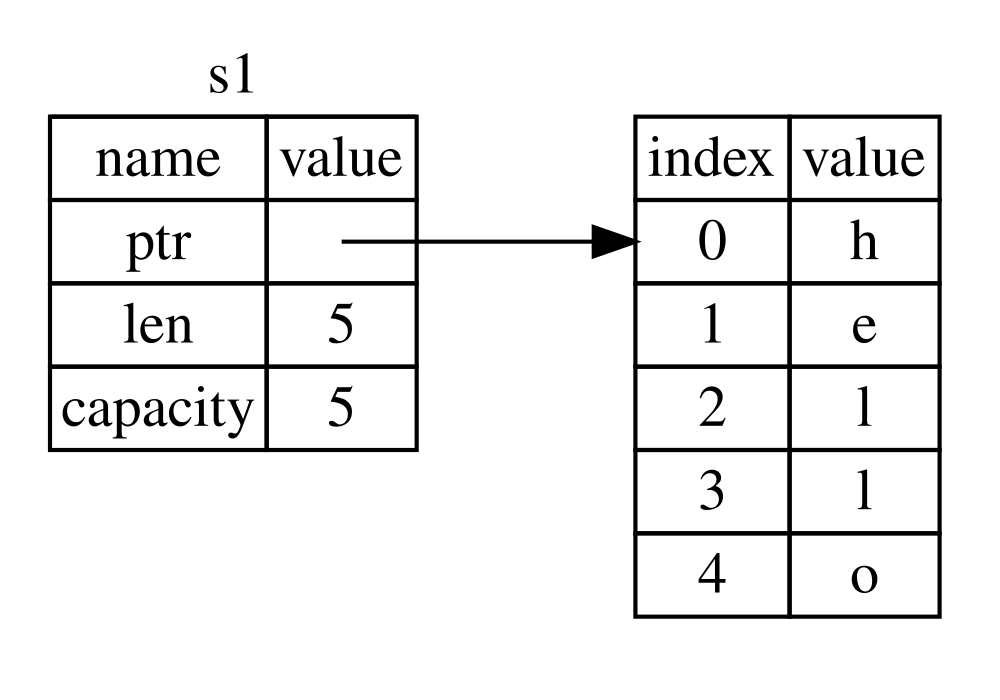

# Rust - Ownership

## What is Ownership

- Rust core mechanism for memory management

## Rules

- Every value has an owner
- There can only be one owner at a time
- When the owner goes out of scope, the value will be dropped

## Take A Look At Ownership Moving case

```rust
fn main() {
    let s = String::from("hello");
    let t = s; // s1 is moved to s2, s1 is no longer valid
    println!("{}", s); // Error
    println!("{}", t); // This works fine
}
```

## Why Ownership Model

Use `String` for instruction

```rust
let s1 = String::from("hello");
let s2 = s1;
```

What `s1` looks like under cover



- **Info Part**, located on stack
  - a pointer to the heap memory where the string data is stored
  - a length field that indicates the length of the string
  - a capacity field that indicates the total allocated memory for the string
- **Data Part**, located on heap
  - the actual string data "hello" stored in heap memory

When `let s2 = s1;`

fig.02  

**Reason 1**

- if Rust performs a shallow copy(fig.02), both `s1` and `s2` would point to the same heap memory
- when both `s1` and `s2` go out of scope and try to free the same memory.
  - which could lead to [double free](c-double-free.md) errors 

fig.03 

**Reason 2**

- if Rust performs a deep copy, 
- it could be very expensive when heap data is large

fig.04 

Here is what Rust do

- When `let s2 = s1;` happens, Rust considers `s1`  as no longer valid
- Known as [move](c++-move-constructor)

## When Ownership Moving Happens

Variable type must be [moveable](rust-concepts.md#move-type)

1. Assignment
2. Function call
3. Return value
4. Struct field move
5. Pattern matching
6. Container Extraction

