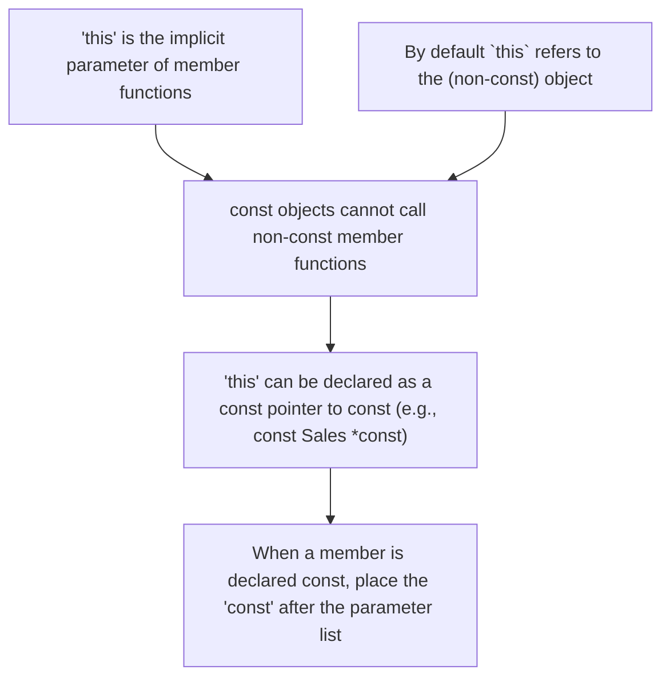

# c++ - const member function

```c++
int func() const {}
```

- Indicates that the implicit parameter `this` for a member function cannot be used to modify the class's data members.
- A const member function is not allowed to modify the object's data members.
- For member functions that do not change the object pointed to by `this`, declaring `this` as `const Sales_data *const` can make the function more flexible.
- The `const` keyword is allowed after a member function's parameter list to declare the function as const.


