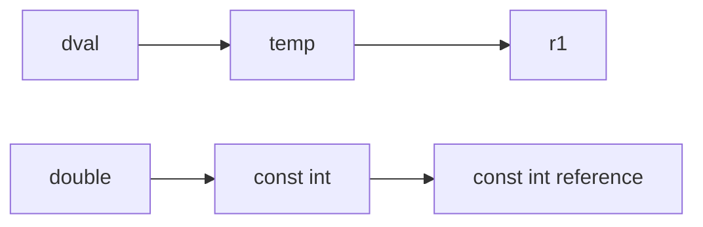

# C++ - Const Reference

- A const reference is an operation qualifier: it prohibits modifying the bound object through the const reference.
- The constness applies to what the reference refers to, not to the reference itself
  - Can bind to non-const objects
  - Can bind to literals
  - Can bind to expressions

```cpp
const int ci = 1024;
const int &r1 = ci;  // OK
r1 = 42;  // Error: r1 is a reference to a const
int &r2 = ci;  // Error: trying to make a non-const reference refer to a const object 
```

Understanding the code above:

- `r1` is a reference to a const, so you cannot change `ci` through the reference — that's what a const reference enforces.
- In the last line, `r2` is a non-const reference and `ci` is const, so the binding is not allowed.

```cpp
double dval = 3.14;
const int &r1 = dval;  // Special case: reference type differs from the referenced object type
```

Normally the reference type matches the referenced object; the above is an exception. In this case the compiler creates an `int` temporary object `temp`, and `r1` refers to `temp`.



If `r1` were not a const reference, by reference semantics an `int`-typed `r1` could attempt to modify the `double`-typed `dval` value — C++ treats that as illegal.

```cpp
int i = 42;
int &r1 = i;  // Define r1 as a normal reference to i
const int &r2 = i;  // Define r2 as a const reference to i
r1 = 0;  // r1 is an alias for i
r2 = 0;  // Error
```
