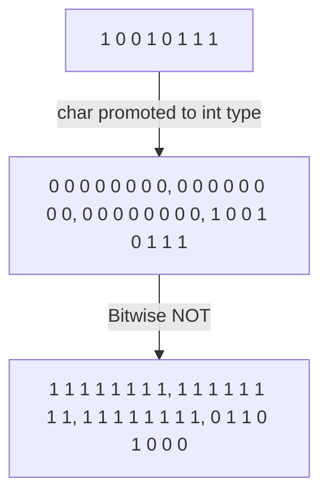

# Bitwise Operators

- The operands are of **integer type**, and integers are treated as a collection of binary bits.
- It is recommended to use them only for unsigned types.
- They can handle signed types, but the value of the sign bit may change, which is undefined behavior.
- Bitwise AND `&`, Bitwise OR `|`.

## Shift Operators

- Left shift operator `<<`, right shift operator `>>`.
- The **left** operand is shifted by the number of bits specified by the **right** operand.
- The `<<` and `>>` defined by the IO library are overloaded versions.
- The left shift operator `<<` inserts zero bits on the right.
  - Equivalent to multiplying by 2.
- The behavior of the right shift operator depends on the type of the left operand.
  - For unsigned types, zeros are inserted on the left.
  - For signed types, either zeros or copies of the sign bit are inserted on the left, depending on the specific environment.
  - Can be understood as dividing by 2.
- The priority of shift operators is lower than **arithmetic operators**, but higher than **relational, assignment, and conditional operators**.

## Bitwise NOT Operator

- `~`

```c++
unsigned char bits = 0227;  // 1 0 0 1 0 1 1 1
~bits;  // 1 1 1 1 1 1 1 1 1 | 1 1 1 1 1 1 1 1 | 1 1 1 1 1 1 1 1 | 0 1 1 0 1 0 0 0 |
```



- Changes 1 to 0, and 0 to 1.

## XOR Operator

- `^`
- If there is exactly one 1 at the corresponding position, the bit is 1; otherwise, it is 0.
