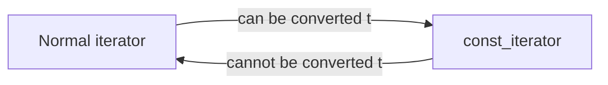

# Container Operations

- Some operations are provided by all containers.
- Some operations are for **sequential containers**, some are only for **associative containers**, and some are for **unordered containers**.
- There are also some that only apply to a small number of containers.
- The iterator range is from the first element to the one after the last element, $[begin, end)$.
  - When begin is equal to end, the range is empty.
  - If begin and end are not equal, the range contains at least one element, and begin points to the first element.
  - We can increment begin several times to make begin == end true.
- `cbegin` and `cend` are `const` members of the container, and their **return type** is `const_iterator`, which is a low-level **const**.
- `cbegin` and `cend` can be **read**, but not **written** to.
- In the past, C++ had to **explicitly** declare which iterator to use; the new standard implements the use of **auto** to declare iterators.



```c++
while (begin != end) {
    *begin = val;
    ++begin;
}
```
